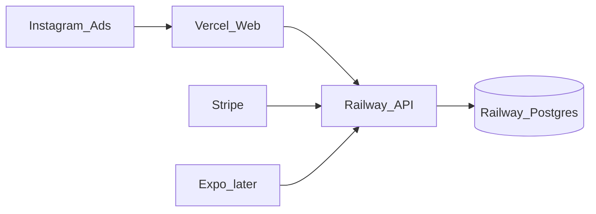

# Attune — Production launch runbook

Goal: public web live ASAP → ads → App Store when Apple/Google accounts are ready.

## Architecture (production)

| Piece | Host | Notes |
|-------|------|--------|
| Web (`apps/web`) | **Vercel** | Auto-deploy from `main` |
| API (`apps/api`) | **Railway** | Postgres + NestJS |
| Mobile | Expo EAS later | Needs Apple Developer + Play Console |



## 1) Accounts to create (you)

1. [Vercel](https://vercel.com) — sign in with GitHub `jeansgray`
2. [Railway](https://railway.app) — sign in with GitHub
3. [Stripe](https://dashboard.stripe.com) — create products `attune_plus_monthly` / `attune_plus_yearly`
4. Custom domain (optional but strongly recommended for ads) — e.g. `attune.app`

## 2) Deploy API + database (Railway)

```bash
# Install CLI once
npm i -g @railway/cli
railway login
cd apps/api
railway init   # create project "attune-api"
railway add --database postgres
railway up
```

Set Railway variables:

```
JWT_SECRET=<long-random-string>
JWT_EXPIRES_IN=7d
CORS_ORIGIN=https://YOUR_VERCEL_DOMAIN,https://attune.app
WEB_URL=https://YOUR_VERCEL_DOMAIN
NODE_ENV=production
ALLOW_DEV_BILLING=false
STRIPE_SECRET_KEY=sk_live_...
STRIPE_WEBHOOK_SECRET=whsec_...
STRIPE_PRICE_MONTHLY=price_...
STRIPE_PRICE_YEARLY=price_...
DATABASE_URL=<auto from Railway Postgres>
```

Run migrate + seed once:

```bash
railway run npx prisma migrate deploy
railway run npx prisma db seed   # optional demo users — remove before heavy ads if you want
```

Public API URL will look like: `https://attune-api-production.up.railway.app`

## 3) Deploy web (Vercel)

```bash
npm i -g vercel
cd apps/web
vercel login
vercel link   # root should be apps/web OR use vercel.json at repo root
vercel --prod
```

Vercel project settings:

- **Root Directory:** `apps/web`
- **Install Command:** `cd ../.. && pnpm install`
- **Build Command:** `cd ../.. && pnpm --filter @attune/shared build && pnpm --filter @attune/web build`
- **Output Directory:** `.next`

Env vars on Vercel:

```
NEXT_PUBLIC_API_URL=https://YOUR_RAILWAY_API_URL
```

Repo root includes [vercel.json](../vercel.json) to help monorepo installs.

## 4) Stripe webhooks

Endpoint: `https://YOUR_RAILWAY_API_URL/api/billing/stripe/webhook`

Events:

- `checkout.session.completed`
- `customer.subscription.updated`
- `customer.subscription.deleted`

## 5) Go-live checklist

- [ ] Privacy/terms live at `/privacy` and `/terms`
- [ ] Replace `privacy@attune.app` with a real inbox
- [ ] `ALLOW_DEV_BILLING=false`
- [ ] Test register → onboarding → discover → like → match → chat
- [ ] Test Plus checkout (Stripe test mode first, then live)
- [ ] Custom domain + HTTPS
- [ ] Instagram bio points to production URL
- [ ] Start ads with $10–20/day using [INSTAGRAM_MARKETING.md](./INSTAGRAM_MARKETING.md)

## 6) App Store (parallel track)

Follow [STORE_LAUNCH.md](./STORE_LAUNCH.md). Web can make money via Stripe while mobile review is pending.

## Money path (realistic order)

1. **Week 0:** Production web + Stripe live  
2. **Week 1:** Instagram organic + light ads → waitlist/signups  
3. **Week 2–4:** Convert free → Attune Plus; iterate creative  
4. **When Apple ready:** EAS submit iOS/Android via RevenueCat  

Dating/friendship apps need density — ads + retention matter more than features at first. Focus on one city or niche (e.g. AuDHD adults) before going broad.
